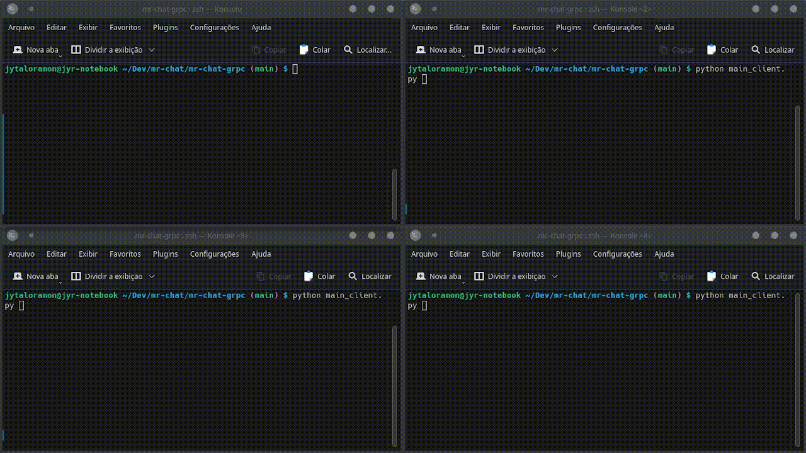

# MR-Chat

## Dupla do Trabalho

- José Ytalo Ramon de Almeida Gonçalves - 19111001
- Mateus Aristides Honorato dos Santos - 19111176

 

## Chat usando gRPC

#### Implementação de um chat usando gRPC

* Trabalho em dupla.
* Linguagem de programação livre (em alguns casos, pedirei que me explique).
* O chat poderá ser simples, onde os dois comunicantes enviam e recebem mensagens.

### Como Rodar o Projeto

- Linguagem Python

1. Entre na pasta do projeto.
2. Instale as depedências rodando:
   - **# pip install -r requirements.txt**
   - Ou manualmente instale *grpcio* e *grpcio-tools* via *pip*
3. Execute o servidor: **# python main_server.py**
4. Execute o(s) clientes(s): **# python main_client.py**. **obs: execute vários em diferentes terminais**

### Vídeo de Apresenção (Breve)

