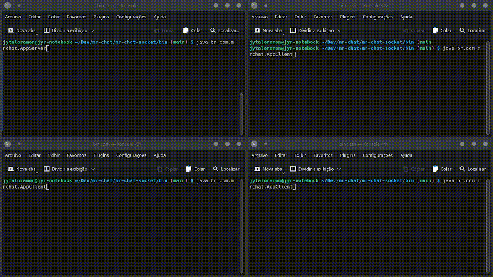

# MR-Chat

## Dupla do Trabalho

- José Ytalo Ramon de Almeida Gonçalves - 19111001
- Mateus Aristides Honorato dos Santos - 19111176

 

## Chat usando sockets

### Implementação de um chat usando sockets

* Trabalho em dupla
* Linguagem de programação livre (em alguns casos, pedirei que me explique)
* O chat poderá ser simples, onde os dois comunicantes enviam e recebem mensagens

### Como Rodar o Projeto

- Linguagem Java

#### Com Make (Linux)

1. Entre na pasta do projeto.
2. Crie uma pasta como o nome "bin", execute: 
   - **# make create_folder_build**
3. Compile as classe executando:
   - **# make compile_socket_chat**
4. Entre na pasta "bin":
   - **# cd bin**
5. Execute o servidor:
   - **# java br.com.mrchat.AppServer**
6. Execute o(s) clientes(s):
   - **# java br.com.mrchat.AppClient**.
   - *obs: execute vários em diferentes terminais*

#### Manual

1. Entre na pasta do projeto.
2. Crie uma pasta como o nome "bin":
   - **# mkdir bin**
3. Compile executando no terminal:
   - **# javac -d bin -sourcepath src src/br/com/mrchat/AppServer.java src/br/com/mrchat/AppClient.java**
4. Entre na pasta "bin":
   - **# cd bin**
5. Execute o servidor:
   - **# java br.com.mrchat.AppServer**
6. Execute o(s) clientes(s):
   - **# java br.com.mrchat.AppClient**. **obs: execute vários em diferentes terminais**

### Vídeo de Apresentação (Breve)

